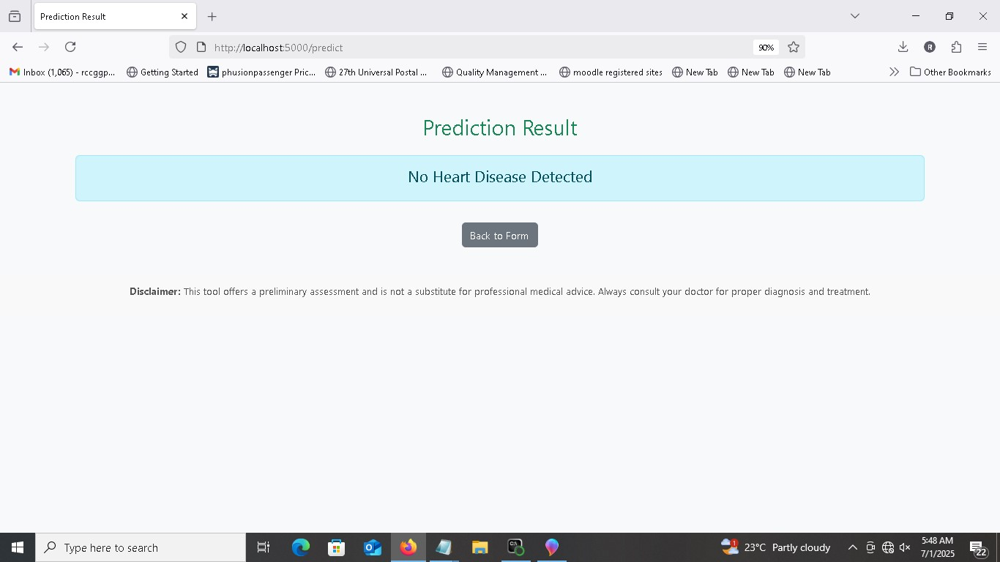

# DSA Heart Disease Prediction Model

This is the capstone project for the Digital Skillup Africa (DSA) AI/ML Foundation program. It is a Flask-based web application that predicts the likelihood of heart disease using a machine learning model.

##  Project Description

The application allows users to input patient data and receive a prediction result (e.g., high or low risk of heart disease). It is powered by a trained machine learning model (Logistic Regression and/or Random Forest).

##  Live Demo

https://heartdisease-predictor-e60z.onrender.com/

##  Project Structure

dsa-heart-predictor/
├── app.py # Flask app
├── models/
│ └── logistic_regression_model.pkl
├── templates/
│ ├── index.html # Input form page
│ └── result.html # Prediction result page
├── static/ # (Optional) For CSS/images
├── requirements.txt # Python dependencies
├── Procfile # For deployment on Render
└── README.md


##  Features

- User-friendly web form
- Logistic Regression and/or Random Forest ML model
- Real-time prediction
- Bootstrap UI styling
- Ready for deployment on Render


##  Screenshots

###  Home Page – User Input Form


###  Result Page – Prediction Output



## 🛠 How to Run Locally

1. Clone the repository:

```bash
git clone https://github.com/YOUR_USERNAME/dsa-heart-predictor.git
cd dsa-heart-predictor


2. Install dependencies:

pip install -r requirements.txt


3. Run the Flask app:

python app.py


Then visit http://127.0.0.1:5000 in your browser.


Deployment

This app can be deployed to platforms like Render or Heroku. The Procfile and requirements.txt are already included for easy deployment.

📌 Disclaimer

This tool offers a preliminary assessment and is not a substitute for professional medical advice. Always consult your doctor for proper diagnosis and treatment.

👨‍Author

    Osagie Sunday

    Capstone project submitted to DSA (The Incubator Hub)


