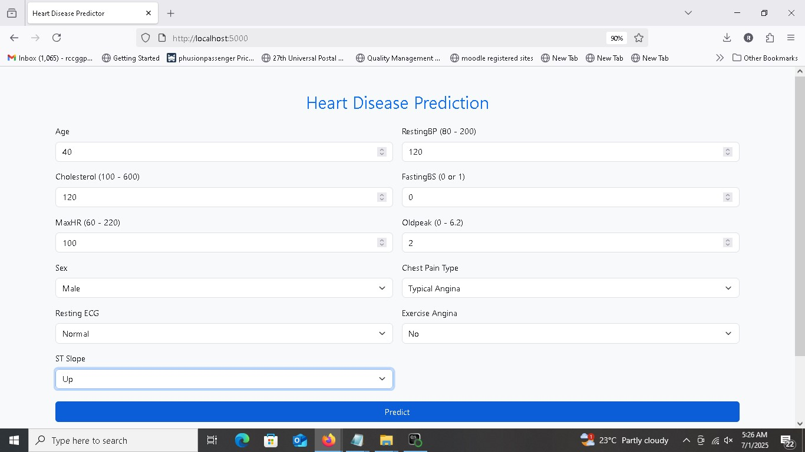

# DSA Heart Disease Prediction Model

This is the capstone project for the Digital Skillup Africa (DSA) AI/ML Foundation program. It is a Flask-based web application that predicts the likelihood of heart disease using a machine learning model.

##  Project Description

The application allows users to input patient data and receive a prediction result (e.g., high or low risk of heart disease). It is powered by a trained machine learning model (Logistic Regression and/or Random Forest).

# Heart Disease Prediction with AI/ML

This project uses supervised machine learning models to predict the likelihood of heart disease in patients based on clinical features. It includes a web-based interface built with Flask for real-time predictions.


## Live Demo
👉 [Launch Web App](https://heartdisease-predictor-e60z.onrender.com/)

## GitHub Repository
👉 [View Source Code](https://github.com/sundayosagie/HeartDisease-)

## 📊 Project Overview

**Category:** Healthcare  
**Problem Statement:** Early prediction of heart disease to assist clinicians in diagnosis and treatment.  
**Model Used:** Logistic Regression & Random Forest  
**AUC Score:** 0.94  
**Accuracy:** 84%

## Tools & Technologies
- Python (3.10)
- Flask
- Pandas, NumPy, Scikit-learn
- Matplotlib & Seaborn
- Render (Deployment)


##  Project Structure

dsa-heart-predictor/
├── app.py # Flask app
├── models/
│ └── logistic_regression_model.pkl
├── templates/
│ ├── index.html 
│ └── result.html 
├── static/ 
├── requirements.txt 
├── Procfile 
└── README.md


## 🧪 Dataset
DSA-Heart-Disease-Predictor/
│
├── app.py
├── requirements.txt
│
├── templates/
│   ├── index.html
│   └── result.html
│
├── models/
│   ├── logistic_regression_model.pkl
│   ├── random_forest_model.pkl
│   └── preprocessor.pkl
│
├── data/
│   └── cleaned_heart.csv
│
├── notebooks/
│   └── heart_disease_model.ipynb
│
├── static/
│
├── screenshots/
│   ├── home.jpg
│   └── result.jpg
│
├── DSA_AI_ML_Final_Project_Sunday_Osagie.pdf
└── README.md

- Source: [UCI Heart Disease Dataset](https://www.kaggle.com/datasets/fedesoriano/heart-failure-prediction)
- Cleaned and saved as `cleaned_heart.csv` in the `/data` folder

##  Features

- User-friendly web form
- Logistic Regression and/or Random Forest ML model
- Real-time prediction
- Bootstrap UI styling
- Ready for deployment on Render


##  Screenshots

###  Home Page – User Input Form


###  Result Page – Prediction Output


## 🛠 How to Run Locally

1. Clone the repository:

```bash
git clone https://github.com/sundayosagie/HeartDisease-Predictor.git
cd heartdisease-predictor


2. Install dependencies:

pip install -r requirements.txt


Run Locally

3. Run the Flask app:

python app.py


Then visit http://127.0.0.1:5000 in your browser.


Deployment

This app can be deployed to platforms like Render or Heroku. The Procfile and requirements.txt are already included for easy deployment.


Models Used
 - Logistic Regression: For baseline performance
 - Random Forest: For better accuracy and robustness
 - Evaluation metrics: Accuracy, Precision, Recall, F1 Score


📌 Disclaimer

This tool offers a preliminary assessment and is not a substitute for professional medical advice. Always consult your doctor for proper diagnosis and treatment.

👨‍Author

    Osagie Sunday

    2025 Capstone project submitted to DSA (The Incubator Hub)


